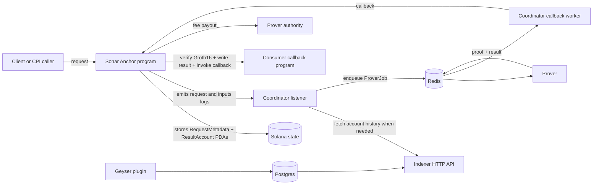

# Sonar

Sonar is a Solana-native ZK coprocessor prototype built around an Anchor program, an off-chain proving pipeline, and a thin developer surface for submitting requests and registering verifiers. The repo now contains a full request -> prove -> callback -> index loop, a real CPI SDK, a developer CLI for verifier registration, Criterion benchmarks for hot paths, and CI/security automation suitable for active development.

Sonar is not production-ready yet. The current state is best described as a hardened devnet-quality system with one end-to-end vertical slice (`historical_avg`) and the core primitives needed to expand toward a multi-computation coprocessor.

## Current status

- On-chain program supports `register_verifier`, `request`, `callback`, and `refund`.
- Off-chain services include a coordinator, prover, indexer, and Geyser plugin.
- `historical_avg` runs end-to-end with an ignored integration test and CI coverage.
- `crates/sdk` provides a real Anchor CPI helper for downstream programs.
- `crates/cli` provides `sonar-cli register` for verifier registration.
- CI runs Rust checks, Anchor build/tests, dependency/license scanning, and secret scanning.
- Benchmarks exist for coordinator and prover hot paths.

## Architecture



## Repository map

| Path                              | Purpose                                                                                |
| --------------------------------- | -------------------------------------------------------------------------------------- |
| `program/`                        | Anchor program that owns request/result/verifier state and verifies proofs on callback |
| `crates/coordinator/`             | Log listener, Redis dispatcher, and callback submission worker                         |
| `crates/prover/`                  | SP1 execution, Groth16 wrapping, artifact export, computation registry                 |
| `crates/indexer/`                 | Geyser plugin, Postgres persistence, and Axum HTTP API                                 |
| `crates/sdk/`                     | Anchor CPI helper for downstream Sonar consumers                                       |
| `crates/cli/`                     | `sonar-cli` for verifier registration                                                  |
| `programs/historical_avg_client/` | Example consumer program that requests the historical-average computation              |
| `echo_callback/`                  | Minimal callback target used by integration flows                                      |
| `tests/`                          | Rust integration/e2e coverage, including historical-average orchestration              |
| `docs/`                           | Current-state, target-state, roadmap, architecture, and contribution docs              |

## Prerequisites

- Rust stable
- Node.js 20+
- Solana CLI 3.0.13
- Anchor CLI 0.32.1
- Docker (for integration and end-to-end flows)
- PostgreSQL and Redis when running the off-chain stack outside the test harness

## Quick start

```bash
npm install
cargo test --workspace -- --skip integration
anchor build
anchor test
```

For the full historical-average vertical slice:

```bash
cargo build --bins
cargo build -p sonar-indexer --lib
anchor build
cargo test --test e2e_historical_avg -- --ignored --nocapture
```

## Common workflows

### Rust quality gates

```bash
cargo fmt --check
cargo clippy --workspace --all-targets --all-features -- -D warnings
cargo test --workspace -- --skip integration
```

### Local GitHub Actions CI

Install `act` to run the GitHub Actions workflows locally before pushing:

```bash
brew install act
```

Or via the upstream install script:

```bash
curl https://raw.githubusercontent.com/nektos/act/master/install.sh | sudo bash
```

The repo includes `.actrc` with the default `ubuntu-latest` image mapping used by `act`.

Before your first local run:

```bash
cp .secrets.example .secrets
```

If you want to run workflows that require GitHub-authenticated actions or API
access, replace the dummy `GITHUB_TOKEN` in `.secrets` with a real token first.

Then execute the local CI wrapper:

```bash
scripts/local-ci.sh
```

The script checks that Docker is installed and running, then invokes `act`
with `.secrets`, cached action content, and cached runner images when possible.
You can pass any normal `act` arguments through the wrapper, for example:

```bash
scripts/local-ci.sh -l
scripts/local-ci.sh pull_request
scripts/local-ci.sh -W .github/workflows/ci.yml -j check
```

### Benchmarks

```bash
cargo bench -p sonar-coordinator
cargo bench -p sonar-prover
```

### Export verifier artifacts

```bash
cargo run --bin sonar-export-artifacts -- artifacts
```

### Register a verifier

```bash
cargo run -p sonar-cli -- register \
  --elf-path programs/historical_avg/elf/riscv32im-succinct-zkvm-elf \
  --keypair ~/.config/solana/id.json \
  --rpc-url "$SOLANA_RPC_URL"
```

`sonar-cli` hashes the ELF to derive the `computation_id`, resolves a Groth16 verifier artifact, builds `register_verifier`, and submits the transaction to Solana.

## Configuration

- `config/default.toml` and `config/devnet.toml` define runtime configuration.
- The off-chain stack is environment-driven for secrets and endpoints.
- The indexer expects Postgres, the coordinator/prover expect Redis, and Solana RPC/WS endpoints are supplied via config or env vars.

## Validation and security automation

- CI: format, clippy, unit/integration tests, Anchor build/tests, e2e flow, and demo verification.
- Security workflow: `cargo audit`, `cargo deny`, and `gitleaks`.
- Pre-commit hooks: Rust fmt/clippy, `cargo deny`, `cargo audit`, and Prettier for Markdown/JSON/YAML.

## Limits of the current repo

- Production economics, fee policy, and capacity planning are still evolving.
- Verifier registration exists, but operational lifecycle management and governance are still manual.
- The repo proves one strong vertical slice today rather than a broad catalog of production computations.
- The system is still oriented around devnet/local-validator workflows, not a hardened mainnet rollout.

## Read next

- `docs/SSOT.md` for the current implementation truth
- `docs/ARCHITECTURE.md` for component and lifecycle detail
- `docs/ROADMAP.md` for what is done versus what remains
- `docs/PROD_TARGET.md` for the desired production shape
- `docs/CONTRIBUTING.md` for local workflow expectations
- `SECURITY.md` for disclosure and secure-development guidance
