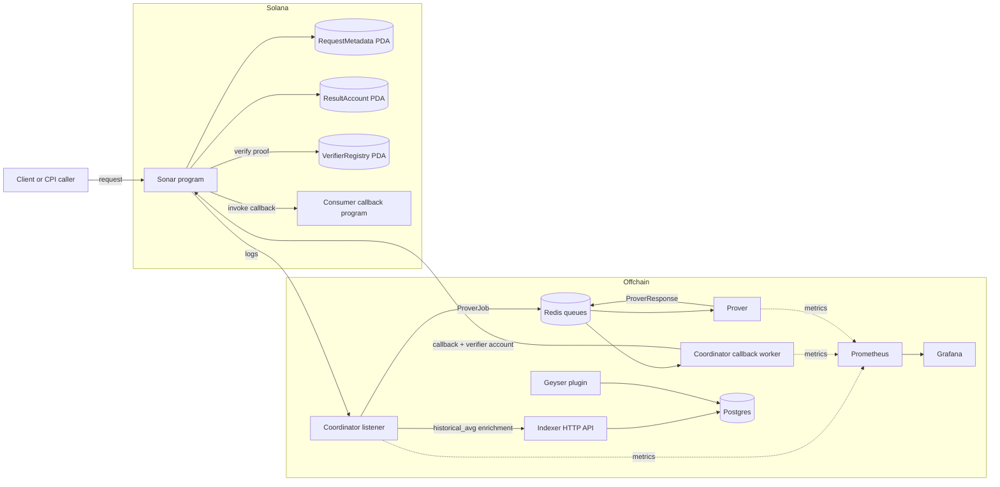
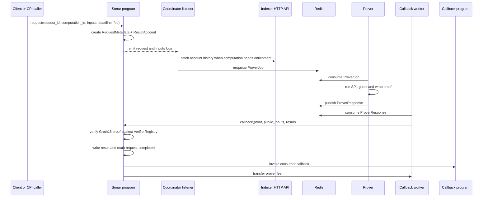

# Sonar Architecture

This document describes the current architecture implemented in the repository.

## High-level component map

## Request lifecycle

## Main components

| Component                         | Responsibility                                                            |
| --------------------------------- | ------------------------------------------------------------------------- |
| `program/`                        | Owns request/result/verifier state and enforces proof verification        |
| `crates/sdk/`                     | Makes request CPI calls ergonomic for downstream Anchor programs          |
| `crates/cli/`                     | Registers verifier keys derived from exported artifacts and ELF hashes    |
| `crates/coordinator/`             | Watches logs, enriches jobs, enqueues proving work, and submits callbacks |
| `crates/prover/`                  | Resolves computations, runs SP1, wraps proofs, exports artifacts          |
| `crates/indexer/`                 | Persists chain data and exposes the account-history query surface         |
| `programs/historical_avg_client/` | Example consumer of the Sonar request path                                |
| `echo_callback/`                  | Minimal callback program used for testing and orchestration               |
| `docker-compose.prod.yml`         | Prod-oriented topology for Postgres, Redis, coordinator, prover, and ops |
| `docker/prometheus/prometheus.yml`| Baseline scrape config for coordinator and prover metrics                 |
| `scripts/deploy-devnet.sh`        | Repeatable devnet deployment helper for the Anchor workspace              |

## On-chain data model

### `RequestMetadata`

Tracks:

- `request_id`
- payer
- callback program
- result account
- computation ID
- deadline
- fee
- status (`Pending`, `Completed`, `Refunded`)
- completion slot

### `ResultAccount`

Tracks:

- `request_id`
- raw result bytes
- whether the result has been set
- write slot

### `VerifierRegistry`

Tracks:

- `computation_id`
- authority
- Groth16 verifying key material
- PDA bump

## Computation model

Two computation IDs are exported directly by the program today:

- `DEMO_COMPUTATION_ID`
- `HISTORICAL_AVG_COMPUTATION_ID`

The crucial architectural distinction is:

- on-chain verification is generic over registered verifier material
- off-chain proving is only available for computations implemented in the prover registry

That means verifier registration is dynamic, but end-to-end support still depends on off-chain computation implementations and artifacts being present.

## Historical-average specialization

`historical_avg` is the most complete end-to-end use case in the repo.

Its special path looks like this:

1. the client submits a request whose raw inputs encode `(pubkey, from_slot, to_slot)`
2. the coordinator parses those inputs from program logs
3. the coordinator fetches balance history from the indexer API
4. the fetched balances become the serialized prover inputs
5. the prover computes the average and produces the proof/result bundle
6. the callback writes the final value on-chain

This split demonstrates how Sonar can combine on-chain triggers with off-chain data enrichment while preserving an on-chain verification step.

## Trust boundaries

### Trusted for correctness

- the Sonar program's account constraints and proof verification
- the registered verifier material for a computation ID
- Solana state transitions once transactions finalize

### Trusted for liveness, not correctness

- coordinator availability
- Redis availability
- prover availability
- indexer freshness and HTTP availability

If off-chain services fail, the system should degrade toward timeout/refund rather than silent correctness failure.

## Operational topology in-repo

The repository now includes a production-oriented Compose topology:

- `postgres` for indexed state storage
- `redis` for coordinator/prover queueing
- `coordinator` and `prover` containers built from the local Dockerfiles
- `prometheus` scraping service-internal metrics endpoints
- `grafana` exposed on host port `3000` by default

The current topology intentionally leaves the indexer outside `docker-compose.prod.yml`. By default, coordinator and prover use `INDEXER_URL=http://host.docker.internal:8080`, so the indexer API must be managed separately when running that stack.

Current metrics wiring:

- coordinator listens on `COORDINATOR_METRICS_PORT`, default `9090`
- prover listens on `PROVER_METRICS_PORT`, default `9091`
- Prometheus scrapes `coordinator:9090` and `prover:9091`

## Devnet deployment flow

`scripts/deploy-devnet.sh` automates the current non-production release path:

1. resolve the deploy wallet from `ANCHOR_WALLET` or `Anchor.toml`
2. switch the Solana CLI to devnet
3. airdrop enough SOL to reach the minimum balance threshold when needed
4. run `anchor keys sync`
5. build with an Anchor fallback to Solana platform-tools `v1.53` when necessary
6. deploy the workspace and verify the resulting program account

## Failure model today

Current expected failure outcomes:

- missed or stalled off-chain processing -> request remains pending until refund path becomes valid
- malformed or mismatched verifier/public inputs -> callback fails on-chain
- stale or unavailable enrichment data -> coordinator/prover job fails, no incorrect result is committed
- worker or queue restart -> jobs may require replay/retry procedures outside the current minimal automation

## Operational notes

- The indexer API is intentionally narrow: account-history lookups only.
- The current queueing model is Redis-based and simple by design.
- CI validates both Rust-native flows and Anchor-based flows.
- Local GitHub Actions reproduction is wrapped by `scripts/local-ci.sh` and `.actrc`.
- Benchmarks currently focus on coordinator and prover hot paths, not full-system load.
- Observability is metrics-only today; dashboards, alerts, and tracing are still future work.
