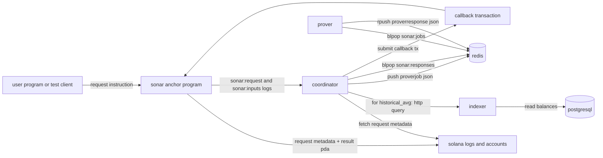
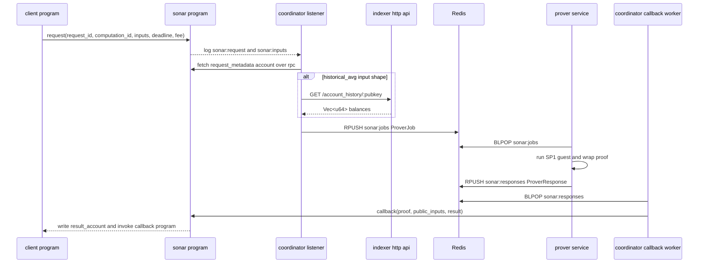

# architecture

## overview

sonar is a Solana zk coprocessor split across four main runtime components:

- an on-chain Anchor program in `program/`
- an indexer crate in `crates/indexer/`
- a coordinator crate in `crates/coordinator/`
- a prover crate in `crates/prover/`

the current repository already implements the request, queueing, proof generation, and callback submission building blocks. the historical-average template is partially wired end to end, but the on-chain verifier registry still only accepts the built-in demo computation id.

## component map

## on-chain program

### purpose

the Anchor program in `program/src/lib.rs` is the trust anchor for result delivery. it stores request metadata, escrows the attached fee, verifies a Groth16 proof, writes the result account, invokes a callback program, and releases the fee to the prover.

### instructions

#### `request`

`request`:

- checks that `deadline > current_slot`
- checks that `fee > 0`
- creates `request_metadata` and `result_account` PDAs
- transfers lamports from the payer into `request_metadata`
- emits two logs:
  - `sonar:request:<hex request id>`
  - `sonar:inputs:<hex encoded raw inputs>`

#### `callback`

`callback`:

- requires the request status to be `pending`
- requires the deadline not to have passed
- verifies the Groth16 proof against the registered verifier key
- writes the result bytes to `result_account`
- marks the request as `completed`
- cpies into the configured callback program using the `sonar_callback` discriminator
- transfers the escrowed fee to the prover signer

#### `refund`

`refund`:

- requires the original payer signer
- requires the request to still be `pending`
- requires the current slot to be greater than `deadline`
- returns the escrowed fee to the payer
- marks the request as `refunded`

### account model

`RequestMetadata` stores:

- `request_id`
- `payer`
- `callback_program`
- `result_account`
- `computation_id`
- `deadline`
- `fee`
- `status`
- `completed_at`
- `bump`

`ResultAccount` stores:

- `request_id`
- `result`
- `is_set`
- `written_at`
- `bump`

### verifier registry

the verifier registry in `program/src/verifier_registry.rs` currently exposes a single built-in demo verifier:

- `DEMO_COMPUTATION_ID`
- `DEMO_VERIFYING_KEY`
- `DEMO_PUBLIC_INPUTS_LEN = 9`

this means the on-chain program does not yet accept the historical-average computation id produced by the prover registry.

## indexer

### purpose

the indexer crate serves two roles:

- a loadable Geyser plugin through `cdylib`
- a normal Rust library and binary for database access and an HTTP query API

### storage

`crates/indexer/src/db.rs` manages PostgreSQL access. the schema is created from the embedded migration `202603310001_init_account_history.sql`.

main operations:

- connect to PostgreSQL with SQLx
- run embedded migrations
- insert batched account updates into `account_history`
- upsert slot metadata into `slot_metadata`
- query ordered account history
- query the latest snapshot at a slot
- query lamport balances for a pubkey and slot range

### http api

`crates/indexer/src/server.rs` exposes:

- `GET /account_history/:pubkey?from_slot=<u64>&to_slot=<u64>`

behavior:

- `:pubkey` is base58-decoded
- the handler rejects invalid base58 and wrong-length keys with `400`
- successful responses return `json` containing `Vec<u64>` lamport balances in slot and write-version order

### binary

`bin/indexer.rs`:

- loads config through `sonar_common::config::Config`
- connects to PostgreSQL
- runs migrations
- starts the axum server on `indexer.http_port`

## coordinator

### purpose

the coordinator is the bridge between Solana, the indexer, Redis, and the callback transaction path.

### listener path

`crates/coordinator/src/listener.rs`:

- subscribes to Solana websocket logs mentioning the sonar program id
- parses `sonar:request:` logs into request ids
- parses `sonar:inputs:` logs into raw inputs
- fetches the `RequestMetadata` account over RPC
- builds a `ProverJob`
- pushes JSON jobs to `sonar:jobs`

for historical-average requests, the listener also:

- decodes the 48-byte raw input payload as `pubkey + from_slot + to_slot`
- calls the indexer HTTP endpoint
- serializes the returned `Vec<u64>` with `bincode`
- replaces the original raw inputs with the balance vector bytes before dispatch

current limitation:

- the listener identifies historical-average requests by raw input length and shape, not by a dedicated on-chain enum or verifier-aware routing rule

### callback worker

`crates/coordinator/src/callback.rs`:

- pops `ProverResponse` JSON values from `sonar:responses`
- fetches `RequestMetadata` to recover the callback program pubkey
- builds the Anchor `callback` instruction bytes manually
- sends and confirms the Solana transaction with retries

current limitation:

- the callback worker now forwards prover-produced `public_inputs`
- the historical-average path still relies on an MVP verifier helper in the on-chain program rather than a final production verifier rollout
- this means the local historical-average flow works end to end, but it should still be described as MVP-grade rather than production-final

### binary

`bin/coordinator.rs` runs two tasks:

- listener task
- callback worker task

it reads config from `SONAR_CONFIG_PATH` and an optional signing keypair from `SONAR_COORDINATOR_KEYPAIR_PATH`.

## prover

### purpose

the prover consumes jobs from Redis, resolves a registered computation, runs the matching SP1 guest, wraps the proof, and publishes a response.

### registry

`crates/prover/src/registry.rs` registers two computations by ELF hash:

- `fibonacci`
- `historical_avg`

computation ids are the sha256 hash of the guest ELF bytes.

### proving path

`crates/prover/src/lib.rs`:

- resolves the computation id to a named ELF
- loads the ELF from `programs/*/elf/`
- runs either the fibonacci or historical-average SP1 wrapper
- wraps the resulting proof bundle with `wrap_stark_to_groth16`
- returns `(proof, result)`

`crates/prover/src/sp1_wrapper.rs` contains two important execution paths:

- `run_sp1_program` for the fibonacci guest
- `run_historical_avg_program` for a bincode-encoded `Vec<u64>`

for local development the prover can run in mock mode:

- `bin/prover.rs` sets `SP1_PROVER=mock` when `config.prover.mock_prover` is true and the env var is not already set

### queue service

`crates/prover/src/service.rs`:

- `BLPOP`s `sonar:jobs`
- deserializes `ProverJob`
- processes jobs with bounded concurrency using a semaphore
- `RPUSH`es `ProverResponse` into `sonar:responses`

## shared crates

### `crates/common`

shared items include:

- config parsing with `${ENV_VAR}` expansion
- common request, response, and queue types
- tracing initialization and metrics helpers

### `crates/sdk`

`crates/sdk` exists but is minimal today. it only exports a module named `macro` and does not yet provide a full rust client sdk.

### `echo_callback`

`echo_callback` is a test-only Anchor helper program. it accepts the callback CPI and returns immediately. the source explicitly warns that it must not be deployed to mainnet.

## data flow details

## security model

### what is currently enforced on-chain

the code enforces these properties on-chain:

- request deadlines and fee presence are checked in `request`
- fees stay escrowed in the request metadata account until `callback` or `refund`
- a callback can only succeed once per pending request
- proof verification happens inside the program for known computation ids
- the callback target must be executable
- refunds can only be claimed by the original payer after deadline expiry

### what is currently trusted off-chain

these areas still rely on operator trust or unfinished wiring:

- service liveness depends on the coordinator, prover, Redis, PostgreSQL, and Solana RPC availability
- historical-average inputs are fetched by the coordinator from the indexer and are not committed on-chain before proof verification
- the historical-average verifier path in the on-chain program is still MVP-specific rather than a finished production verifier rollout
- there is no staking, slashing, prover admission policy, or multi-prover consensus mechanism in the codebase yet

### practical consequence

sonar currently provides strong on-chain correctness guarantees for the demo Groth16 verifier path used in program tests. in addition, the repository now demonstrates a working local historical-average MVP path from request to callback, but that path is not yet a finished production verifier rollout.

## current performance-related settings

these are the concrete limits or defaults present in code and config today:

| setting | value | source |
| --- | --- | --- |
| max result bytes | `10_000` | `program/src/lib.rs` |
| coordinator callback timeout | `30` seconds | `config/default.toml` |
| coordinator max concurrent jobs | `8` | `config/default.toml` |
| prover poll timeout | `1` second | `crates/prover/src/service.rs` |
| callback worker redis pop timeout | `2.0` seconds | `bin/coordinator.rs` |
| indexer concurrency | `4` | `config/default.toml` |
| indexer http port | `8080` | `config/default.toml` |
| metrics port | `9090` | `config/default.toml` |

these are operational defaults, not guaranteed benchmarks.

## limitations and future work

the following gaps are visible directly in the repository:

- historical-average callback verification is still MVP-specific and not yet presented as a final production verifier design
- `config/devnet.toml` predates the phase 6 config shape and is missing `indexer.http_port` and `coordinator.indexer_url`
- `tests/integration.rs` and `tests/property.rs` are placeholders for later phases
- `crates/sdk` is still a stub and there is no checked-in ts sdk or cli
- no production deployment manifests are present for Redis, PostgreSQL, or the service processes

until those gaps are closed, the repository is best understood as a strong local-development and architecture baseline rather than a finished production network.