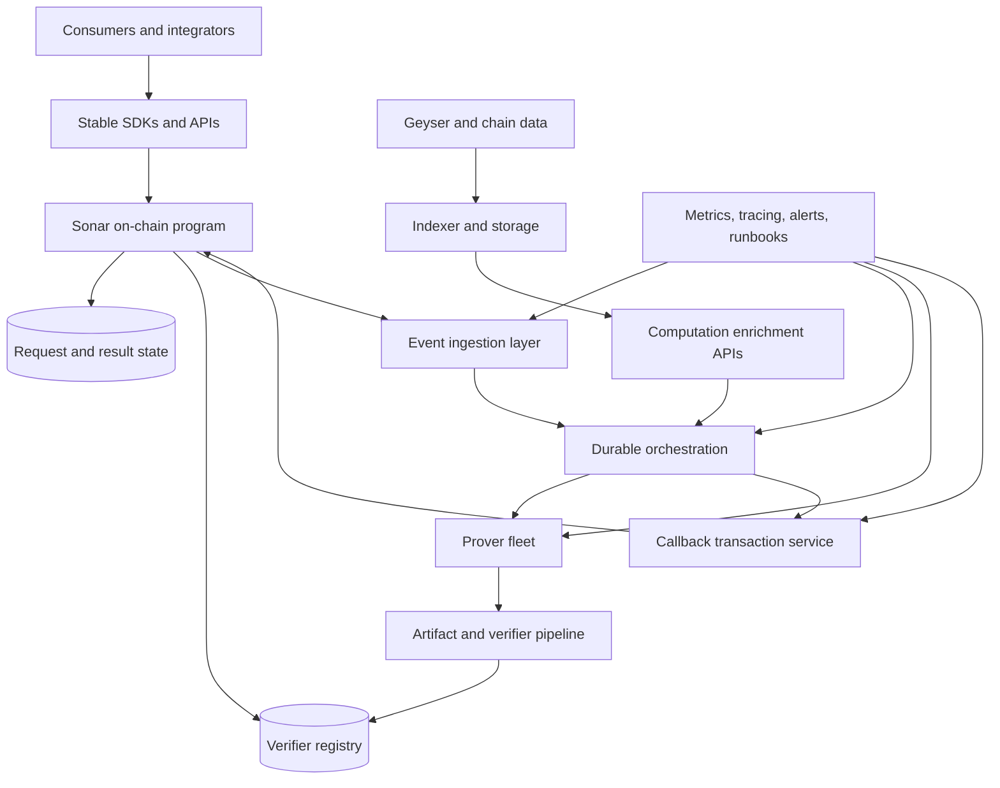

# Sonar Production Target

This document describes the desired production shape of Sonar, not the exact state of the current repository.

## Goal

Sonar should mature into a reliable Solana coprocessor platform where:

- consumers can submit verifiable off-chain computations through a stable interface
- operators can register, rotate, and retire computation verifiers safely
- proving pipelines can absorb load spikes without silently degrading correctness or latency
- observability and governance are good enough for real money and real incident response

## Target architecture

## Production pillars

### 1. Correctness first

The production system should preserve the current correctness model while making it operationally safer:

- every accepted computation has an explicitly managed verifier
- every callback is attributable to a known prover path and artifact lineage
- every refund or failure state is explainable from durable logs and metrics

### 2. Durable orchestration

The current Redis-based job flow is a reasonable development baseline, but production should have:

- stronger replay guarantees
- poison-job handling
- visibility into stuck or slow callbacks
- idempotent recovery for worker restarts and chain reorg edge cases

### 3. Verifier lifecycle management

Production Sonar should treat verifier data as governed infrastructure:

- artifact provenance recorded and reviewable
- key rotation and revocation procedures documented
- staged activation for new computations and verifier versions
- authority changes controlled and auditable

### 4. Observable operations

Operators should be able to answer, in real time:

- how many requests are pending
- how long proof generation is taking
- how often callbacks fail and why
- whether the indexer is fresh enough for enrichment workloads
- whether payout economics remain healthy under current load

### 5. Safe external adoption

Production Sonar should make it easy for downstream teams to integrate safely:

- stable SDKs for request submission
- example consumer programs and reference apps
- documented API contracts and versioning policy
- clearer operator/developer separation of concerns

## Capability checklist

Before Sonar should be presented as production-capable, it should have:

- formal environment promotion path: local -> devnet -> staging -> production
- reproducible artifact generation and publication
- verifier governance and break-glass procedures
- incident playbooks for queue outages, proof failures, and stale indexer data
- dashboard coverage for all critical service and chain-facing paths
- external security review aligned with deployment scope

## What the current repo already contributes

The present repository already provides strong seeds for this target:

- the core on-chain lifecycle exists
- the verifier registry model exists
- the proving and artifact pipeline exists
- an end-to-end computation slice exists
- CI/security automation and benchmarks now exist

The remaining work is mainly operational maturity, governance, and scale.
