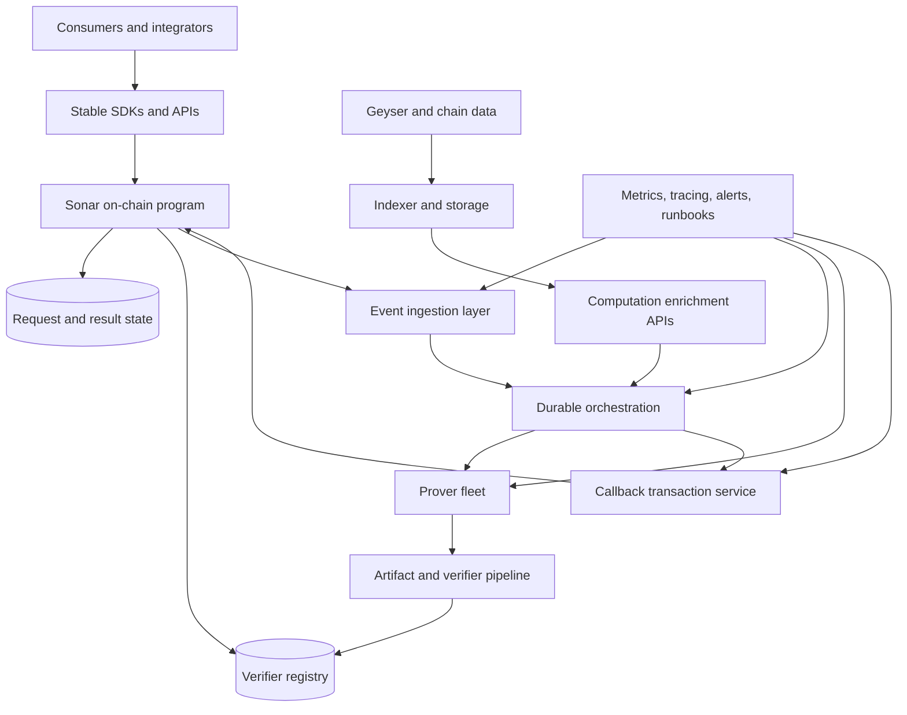

# Sonar Production Target

This document describes the desired production shape of Sonar, not the exact state of the current repository.

## Goal

Sonar should mature into a reliable Solana coprocessor platform where:

- consumers can submit verifiable off-chain computations through a stable interface
- operators can register, rotate, and retire computation verifiers safely
- proving pipelines can absorb load spikes without silently degrading correctness or latency
- observability and governance are good enough for real money and real incident response

## Target architecture

## Production pillars

### 1. Correctness first

The production system should preserve the current correctness model while making it operationally safer:

- every accepted computation has an explicitly managed verifier
- every callback is attributable to a known prover path and artifact lineage
- every refund or failure state is explainable from durable logs and metrics

### 2. Durable orchestration

The current Redis-based job flow is a reasonable development baseline, but production should have:

- stronger replay guarantees
- poison-job handling
- visibility into stuck or slow callbacks
- idempotent recovery for worker restarts and chain reorg edge cases

### 3. Verifier lifecycle management

Production Sonar should treat verifier data as governed infrastructure:

- artifact provenance recorded and reviewable
- key rotation and revocation procedures documented
- staged activation for new computations and verifier versions
- authority changes controlled and auditable

### 4. Observable operations

Operators should be able to answer, in real time:

- how many requests are pending
- how long proof generation is taking
- how often callbacks fail and why
- whether the indexer is fresh enough for enrichment workloads
- whether payout economics remain healthy under current load

### 5. Safe external adoption

Production Sonar should make it easy for downstream teams to integrate safely:

- stable SDKs for request submission
- example consumer programs and reference apps
- documented API contracts and versioning policy
- clearer operator/developer separation of concerns

## Capability checklist

Before Sonar should be presented as production-capable, it should have:

- formal environment promotion path: local -> devnet -> staging -> production
- reproducible artifact generation and publication
- verifier governance and break-glass procedures
- incident playbooks for queue outages, proof failures, and stale indexer data
- dashboard coverage for all critical service and chain-facing paths
- external security review aligned with deployment scope

## What the current repo already contributes

The present repository already provides strong seeds for this target:

- the core on-chain lifecycle exists
- the verifier registry model exists
- the proving and artifact pipeline exists
- an end-to-end computation slice exists
- CI/security automation and benchmarks now exist

The remaining work is mainly operational maturity, governance, and scale.# Sonar Production Target

This document describes the desired production shape of Sonar, not the exact state of the current repository.

## Goal

Sonar should mature into a reliable Solana coprocessor platform where:

- consumers can submit verifiable off-chain computations through a stable interface
- operators can register, rotate, and retire computation verifiers safely
- proving pipelines can absorb load spikes without silently degrading correctness or latency
- observability and governance are good enough for real money and real incident response

## Target architecture

## Production pillars

### 1. Correctness first

The production system should preserve the current correctness model while making it operationally safer:

- every accepted computation has an explicitly managed verifier
- every callback is attributable to a known prover path and artifact lineage
- every refund or failure state is explainable from durable logs and metrics

### 2. Durable orchestration

The current Redis-based job flow is a reasonable development baseline, but production should have:

- stronger replay guarantees
- poison-job handling
- visibility into stuck or slow callbacks
- idempotent recovery for worker restarts and chain reorg edge cases

### 3. Verifier lifecycle management

Production Sonar should treat verifier data as governed infrastructure:

- artifact provenance recorded and reviewable
- key rotation and revocation procedures documented
- staged activation for new computations and verifier versions
- authority changes controlled and auditable

### 4. Observable operations

Operators should be able to answer, in real time:

- how many requests are pending
- how long proof generation is taking
- how often callbacks fail and why
- whether the indexer is fresh enough for enrichment workloads
- whether payout economics remain healthy under current load

### 5. Safe external adoption

Production Sonar should make it easy for downstream teams to integrate safely:

- stable SDKs for request submission
- example consumer programs and reference apps
- documented API contracts and versioning policy
- clearer operator/developer separation of concerns

## Capability checklist

Before Sonar should be presented as production-capable, it should have:

- formal environment promotion path: local -> devnet -> staging -> production
- reproducible artifact generation and publication
- verifier governance and break-glass procedures
- incident playbooks for queue outages, proof failures, and stale indexer data
- dashboard coverage for all critical service and chain-facing paths
- external security review aligned with deployment scope

## What the current repo already contributes

The present repository already provides strong seeds for this target:

- the core on-chain lifecycle exists
- the verifier registry model exists
- the proving and artifact pipeline exists
- an end-to-end computation slice exists
- CI/security automation and benchmarks now exist

The remaining work is mainly operational maturity, governance, and scale.# production target

## purpose

this document describes the production architecture Sonar is moving toward after the current MVP baseline.

it is intentionally forward-looking. unlike [docs/SSOT.md](docs/SSOT.md), it is not limited to code already implemented in this repository.

this file translates that direction into a stable repository doc that contributors can use without confusing future targets with current implementation facts.

## how to read the docs set

- [docs/SSOT.md](docs/SSOT.md) = what is implemented today
- [docs/ROADMAP.md](docs/ROADMAP.md) = canonical execution plan from the current MVP to the production target
- this file = the architecture and product shape Sonar is aiming to reach

## current baseline inherited from the MVP

the repository already has a working local and CI-validated baseline for:

- on-chain `request`, `callback`, and `refund`
- PDA-based request metadata and result storage
- Redis-backed job dispatch between the coordinator and prover
- PostgreSQL-backed historical account indexing and HTTP lookup
- SP1-backed computation execution for registered ELFs
- a working local historical-average flow with e2e coverage and demo verification

that baseline is the launch point for the production path below.

## production target summary

the production version of Sonar is intended to be a Solana ZK coprocessor that lets programs request heavyweight or historical-state-dependent computation off-chain and receive a cryptographically verified result on-chain with a stable developer experience and a path toward decentralization.

the intended evolution has five major pillars.

## 1. production on-chain verification

the current MVP historical-average path uses an MVP verifier helper. the production target replaces that with a true computation-driven verifier flow.

target properties:

- each computation is identified by a stable `computation_id`
- a Groth16 verifying key can be associated with that computation on-chain
- callback verification uses the correct verifier material for that computation rather than a demo alias
- the core program can support additional computations without repeating the current MVP-specific shortcut

the production direction from the v3 docs is a dynamic verifying-key registry keyed by `computation_id`.

## 2. hardened callback and proof formatting pipeline

the current repository already moves proof and public-input data through the coordinator and prover. the production target hardens that flow so the callback path is fully cryptographic, strictly formatted, and resilient to malformed payloads.

target properties:

- proof artifacts are produced in a deterministic format
- callback payload construction is robust and test-covered
- invalid proofs and invalid public inputs are rejected explicitly on-chain
- security tests cover forged, mutated, and replay-style failure cases

## 3. stronger reliability and operational hardening

the MVP proves the system works. the production target proves it keeps working under bad inputs, bad timing, and bad infrastructure conditions.

target properties:

- property tests for guest and prover input handling
- chaos and recovery tests for queue and worker behavior
- tighter refund edge-case coverage around slot timing
- better indexing and callback-transaction performance under realistic load
- cleaner configuration parity between local, devnet, and production-like environments

## 4. developer-facing productization

the current repo has the protocol pieces, but only a thin SDK surface. the production target makes Sonar easier to integrate.

target properties:

- a more ergonomic Rust SDK / CPI helper story
- a CLI or equivalent automation for build, artifact extraction, and verifier registration
- clearer deployment and integration guidance
- a smoother path from guest program build artifacts to on-chain registration and callback consumption

## 5. progressive decentralization

the current repository is a centralized MVP topology. the long-term production direction expands beyond that.

target properties:

- a clearer prover economic model
- a staged path from centralized operation to broader prover participation
- better queue, liveness, and fee-market handling as throughput increases
- future support for batching, decentralization, and stronger network-level guarantees

these are architectural targets, not claims about what the current code already implements.

## explicit non-claims

this document does not mean the following are already live in the repository today:

- a production historical-average verifier rollout
- a shipped on-chain verifying-key registry
- a production-ready cli or ts client
- recursive batching in production
- staking, slashing, or token economics in code
- a decentralized prover network

those items remain future work until they are reflected in [docs/SSOT.md](docs/SSOT.md).

## near-term transition checkpoints

the highest-value bridge from the current MVP into this production target is:

1. replace the historical-average MVP verifier path with a real production verifier flow
2. harden callback proof formatting and negative-path security tests
3. add missing property, chaos, and refund-edge-case coverage
4. sync the config and deployment surface with the actual runtime model
5. improve the SDK, tooling, and deployment ergonomics around the proving pipeline

## relationship to the preserved v3 drafts

the v3 drafts in `temp/` remain the richer product and architecture source material. this repository doc keeps the same direction while making the boundary between current implementation and future target explicit.
