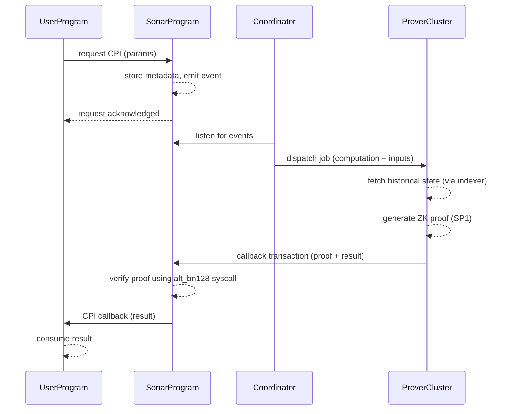

# Sonar – Solana ZK Coprocessor  
**Single Source of Truth (SSOT) – v2.0**  
*March 2026*

---

## 1. Vision & Value Proposition

**Project Name:** Sonar  

**One‑Line Pitch:**  
Sonar is the decentralized ZK coprocessor that lets any Solana program request arbitrary off-chain computation (or data queries) and receive a cryptographically verified result on-chain in seconds, at near-zero cost, with zero trust in any single party.

**Problem Statement:**  
Solana’s compute unit (CU) limits and state access constraints make complex, data‑heavy, or private logic impossible to execute on‑chain. Developers are forced to accept centralization, high latency, or prohibitively expensive on‑chain solutions.

**Solution:**  
Sonar bypasses these constraints. A Solana program makes a single CPI call requesting off‑chain computation (e.g., ML inference, order‑book matching, historical state queries). Sonar’s off‑chain prover fleet executes the work, generates a ZK proof, and returns the verified result in a second transaction—all with ≤200k CU verification cost and no trust in any single prover.

**Target Audience:**  
Every serious Solana builder:  
- DeFi (private AMMs, MEV‑resistant order flow)  
- Gaming (verifiable randomness + off‑chain simulations)  
- AI/ML (on‑chain verifiable inference)  
- RWA (private compliance + historical data)  
- MEV searchers  
- Bridges  
- Any protocol that currently says “this is too expensive/heavy to do on‑chain”

---

## 2. Success Metrics (Mainnet Beta)

| Metric | Target |
|--------|--------|
| **Verification Cost** | ≤ 200k CU (hard cap 250k) |
| **Latency** | P50 < 30s; P95 < 120s |
| **Developer Velocity** | < 30 minutes from “Hello World” to first proof |
| **Economic Efficiency** | > 90% cheaper than equivalent on‑chain compute |
| **Trustlessness** | Full permissionless prover set by Phase 3; Phase 1/2 offer economic security (staking) with trusted set |

---

## 3. Architecture & Components

### 3.1 Overall System Architecture (Progressive Decentralization)

Sonar launches with a high‑performance centralized coordinator to guarantee sub‑30s proof liveness on Day 0. It evolves through three phases:

- **Phase 1: Centralized (Team‑run GPU clusters)** – Fastest path to production, no token required.  
- **Phase 2: Permissioned Prover Set** – Staked partners with slashing; $SONAR token introduced.  
- **Phase 3: Fully Decentralized & Permissionless** – Anyone can stake $SONAR and become a prover; inspired by Boundless.

### 3.2 Native Token: $SONAR

- **Utility:** Staking for provers (economic security + slashing), gas for requests (paid in $SONAR or $SOL), governance.
- **Tokenomics:**
  - 50% Community / Provers
  - 20% Team (4‑year vest)
  - 15% Ecosystem
  - 10% Liquidity
  - 5% Advisors
- **Burn Mechanism:** **10% of every proof fee** is burned, making the token deflationary with network activity.

### 3.3 Request Submission (Developer UX)

A Solana program makes a **single CPI call** to the Sonar program:

```rust
sonar::request(ctx, Compute::HistoricalAvg { account, slots: 1000 }, fee, deadline);
```

Payload includes:
- Computation ID (zkVM image or circuit identifier)
- Inputs (or commitments to inputs)
- Deadline (slot number)
- Priority fee (in $SONAR or $SOL)

**Result Delivery:** The proof and result are returned via a **callback transaction** (asynchronous). The result can be consumed in the same transaction as verification if the calling program uses the callback.

### 3.4 Queue & Indexing

- **On‑chain:** Only minimal metadata (request hash + commitment) stored to keep storage costs near zero.
- **Off‑chain:** A custom Rust‑based indexer listens to Sonar program events using Yellowstone/Geyser. Requests are pushed to a **Redis queue** for provers.

### 3.5 Proving Infrastructure

- **Bootstrap:** Bare‑metal GPU/CPU cluster (e.g., H100, A100) managed with Kubernetes.
- **Software:** Highly parallelized proving workers.
- **Primary Proving System:** **SP1 zkVM** (primary) for arbitrary Rust code, wrapped in **Groth16** for on‑chain verification. Jolt support is available as a secondary feature‑flagged option.
- **Recursive Aggregation:** Uses SP1’s native STARK recursion + final Groth16 wrapper to batch many user requests into a single proof, reducing on‑chain cost.

### 3.6 State Access (The “Secret Sauce”)

- **Solana Historical State:** Sonar ingests state via **Geyser plugins + TimescaleDB**, with a fallback to **Helius Photon** for reliability. A lightweight proprietary mirror may be added in Phase 2 as an optimization.
- **Cross‑Chain State:** Uses **Wormhole** + ZK light clients to trustlessly bring state from Ethereum, Sui, etc.

### 3.7 Data Availability (DA)

- Only **commitments and minimal public inputs** live on‑chain.
- Heavy request/result data is stored off‑chain (Arweave + IPFS) with a ZK proof of inclusion attached to the on‑chain verification.

---

## 4. ZK Proof System & Cryptography

### 4.1 Primary Proving System – “Universal” zkVM Front‑end

- **zkVM Choice:** **SP1** (by Succinct) as the primary system. It has mature Solana‑specific verifier crates, GPU acceleration (Hypercube), and production recursion. **Jolt** is supported via a feature flag for advanced users.
- **Why:** Mass adoption requires that developers write normal Rust, not custom circuits.

### 4.2 On‑Chain Verification – “Succinct” Back‑end

- Regardless of the proving system used off‑chain, the final proof is **wrapped in Groth16**.
- Solana natively supports Groth16 verification via **alt_bn128 syscalls**, achieving **≤200k CU** verification cost.

### 4.3 Computations Supported

- **Arbitrary Compute:** General Rust code via SP1 zkVM.
- **Optimized Templates:** Pre‑built, domain‑specific circuits for common tasks:  
  - Historical TWAP / average balance  
  - Private order matching  
  - ML inference (e.g., linear regression, small neural nets)  
  - Signature aggregation  
  - Merkle proofs over state

### 4.4 Recursive Proof Aggregation

- **Mandatory for scaling.** Uses SP1’s native STARK recursion to prove multiple zkVM executions, then wraps the final STARK proof in a single Groth16 proof for Solana.
- Benefit: Drastically reduces per‑user cost and on‑chain footprint.

### 4.5 Unified SDK

- Developers use a single SDK that abstracts the underlying cryptography.  
- The Sonar router automatically selects the most efficient backend (SP1 default, Jolt optional) and handles recursive wrapping into Groth16.

### 4.6 Core Libraries

| Component | Library / Tool |
|-----------|----------------|
| **Proving (zkVM)** | SP1 SDK (primary), Jolt (optional) |
| **Proving (custom circuits)** | arkworks |
| **On‑Chain Verification** | `groth16‑solana` (using alt_bn128 syscalls) |
| **Recursive Aggregation** | SP1’s recursion + custom Groth16 wrapper |

---

## 5. Solana Integration Specifics

### 5.1 Verifier Deployment & Governance

- A **single versioned, upgradeable program** using Solana’s native BPF loader.
- Upgrade authority: Multi‑sig / timelock initially, transitioning to $SONAR governance after Phase 2.

### 5.2 Compute Unit (CU) Economics

- **Target:** ≤ 200k CU for a standard aggregated Groth16 proof.
- **Hard Cap:** 250k CU. If an aggregated proof exceeds this, the batching logic splits into multiple transactions.
- **Why:** Leaves ~1.2M CU available for the calling dapp’s custom logic in the same transaction.

### 5.3 Fee & Payment Model

- Users attach a **SOL or $SONAR fee** directly to the CPI request.
- Dynamic pricing: Off‑chain coordinator validates fee against current hardware/network costs.
- Fee settlement: Held in a vault; released to provers upon successful on‑chain verification.

### 5.4 Asynchronous‑Only Design

- **Flow:**  
  Transaction 1: Request via CPI →  
  Transaction 2: Verified result callback (can be invoked by the prover or a relayer).
- Synchronous proving is impossible due to Solana’s 400ms block time. Sonar optimizes for **next‑block callback** to feel near‑real‑time.

### 5.5 Finality & Reorg Handling (Alpenglow)

- Coordinator leverages **Alpenglow’s fast finality** (100–150ms) to trigger proving early, while still allowing a conservative fallback (e.g., waiting for a full consensus round) for safety.
- Each proof includes a **slot commitment**. If a reorg occurs, the on‑chain verifier rejects the proof, and the user’s fee is automatically refundable.

---

## 6. Off‑Chain Components & Infrastructure

### 6.1 Custom State Indexer

- **Must be built.** A generic RPC cannot deliver the required speed for historical state queries.
- Approach: Use **Geyser plugins + TimescaleDB** to ingest and store account state history, with **Helius Photon** as a fallback for reliability.

### 6.2 Prover Fleet Architecture

- **Auto‑scaling GPU/CPU workers** (Kubernetes) with a job queue.
- **Message bus:** Kafka or Redis Streams for load balancing.
- **Target throughput:** 500+ requests/second at launch; scale to 5,000+ within 6 months via recursive aggregation.

### 6.3 Latency Targets

| Percentile | Target |
|------------|--------|
| **P50** | ≤ 30 seconds |
| **P95** | ≤ 120 seconds |

These are achievable with SP1 + recursion + Alpenglow finality.

### 6.4 Deployment & Liveness

- **Bootstrap:** Bare‑metal GPU instances (H100/A100) in Kubernetes across multiple regions.
- **Redundancy:** Multiple coordinators geographically distributed to survive RPC failures.

### 6.5 Observability

- **Prometheus** for metrics  
- **Grafana** for dashboards  
- **OpenTelemetry** for end‑to‑end tracing (CPI request → callback)

---

## 7. Developer Experience (DX)

**North Star:** *“Adding Sonar to a Solana program should feel like calling a standard Web2 API—zero ZK knowledge required.”*

### 7.1 Primary Interfaces

- **Rust SDK (`sonar-sdk`):**  
  - `#[sonar_compute]` macro to annotate functions that become Sonar requests.
  - Handles zkVM compilation and CPI boilerplate.
- **TypeScript SDK:** For front‑end integration and off‑chain triggers.
- **Sonar CLI:**  
  - `sonar init` – scaffold a new program  
  - `sonar test` – run tests with mock prover  
  - `sonar deploy` – deploy program and register with Sonar

### 7.2 “5‑Minute” Onboarding

- **Templates:** 10+ battle‑ready templates at launch (historical TWAP, private order matching, ML credit scoring, etc.)
- **Documentation:** Mintlify‑style site with interactive playground (simulate a proof request in browser).

### 7.3 Local Development: Sonar‑Devnet

- A custom local validator setup with a **mock prover** that skips heavy GPU computation during development.
- Instant feedback loops; only generates real proofs when `--production` flag is used.

### 7.4 Circuit Definition Paths

1. **Standard (Easy):** Write arbitrary Rust → compiled to SP1 zkVM. Covers 90% of use cases.
2. **Advanced (Performance):** Provide a Rust‑based circuit DSL (arkworks‑native) for hand‑optimized ultra‑heavy logic.

### 7.5 Example Integration

```rust
// In your Solana program
use sonar_sdk::prelude::*;

#[derive(SonarCompute)]
pub struct HistoricalAvg {
    pub account: Pubkey,
    pub slots: u64,
}

#[sonar_compute]
pub fn compute_historical_avg(ctx: &Context, params: HistoricalAvg) -> Result<u64> {
    // This runs inside the zkVM. The actual historical balance data is provided
    // by the indexer and committed to the proof; here we just show the logic.
    let mut total = 0;
    for slot in 0..params.slots {
        let balance = ctx.get_balance_at_slot(params.account, slot)?;
        total += balance;
    }
    Ok(total / params.slots)
}
```

*Note: The `get_balance_at_slot` call in the example is illustrative. In the real implementation, the zkVM receives the required data as pre‑committed inputs from the indexer, not by querying the indexer directly inside the proof.*

---

## 8. Performance & Scalability Targets

| Metric | Launch Target | Scale Target (6 months) |
|--------|---------------|-------------------------|
| **Throughput (RPS)** | 500+ | 5,000+ |
| **Circuit Size (cycles)** | Unlimited (bounded by zkVM memory) | Unlimited |
| **On‑Chain CU per Verification** | ≤ 200k | ≤ 200k |
| **Proof Size** | < 256 bytes (Groth16) | < 256 bytes |
| **End‑to‑End Latency (P95)** | < 120s | < 30s |

---

## 9. Security & Auditing

### 9.1 Zero‑Trust Model

- **Cryptographic trust:** On‑chain verifier relies solely on proof correctness, not on prover honesty.
- **Economic security (Phase 2+):** Provers stake $SONAR; slashed for liveness failures or malformed requests.

### 9.2 Permissioning Strategy

- **Phase 1:** Permissioned prover set (trusted partners) for stability.
- **Phase 3:** Fully permissionless – any node can stake $SONAR and become a prover.

### 9.3 Replay & Attack Prevention

- Every request includes a **unique nonce, slot number, and blockhash**.
- The on‑chain verifier maintains a **nullifier set** (request IDs) to enforce exactly‑once execution.

### 9.4 Auditing & Formal Verification

- **Tier‑1 audits:** Full‑stack audits of on‑chain verifier and off‑chain coordinator by Zellic, Veridise, or similar before mainnet.
- **Formal verification:** Use Lean4 to prove correctness of core cryptographic logic.
- **Bug bounty:** Launched Day 1 of mainnet.

---

## 10. Roadmap & Development Phases

*No hard timeline, but a phased approach:*

1. **Phase 0 – Foundation (Closed prototype)**  
   - Set up Rust toolchains, SP1, and groth16‑solana.  
   - Build minimal verifier program on Solana devnet.  
   - Build simple off‑chain prover that verifies a trivial circuit.

2. **Phase 1 – MVP (Centralized)**  
   - Implement custom indexer (Geyser + TimescaleDB) & coordinator.  
   - Support a few template computations (e.g., historical average).  
   - End‑to‑end flow: CPI request → off‑chain prove → callback verification.  
   - Full CI, pre‑commit hooks, formatting, testing (unit, fuzz, fork tests).  

3. **Phase 2 – Permissioned Prover Set**  
   - Introduce $SONAR token (devnet/testnet).  
   - Staking for provers, slashing for liveness.  
   - Recursive aggregation using SP1 recursion.

4. **Phase 3 – Decentralized**  
   - Open prover set, fully permissionless.  
   - Governance via $SONAR.  
   - Mainnet launch.

5. **Phase 4 – Expansion**  
   - Cross‑chain proofs (Ethereum, Sui).  
   - Advanced optimization for sub‑second proving.

**Testing philosophy:** All types of tests – unit, integration, fuzz, invariant, chaos, fork tests against real Solana state. The developer tests everything manually to ensure production readiness.

---

## 11. Monetization & Sustainability

- **Short‑term:** Grants (apply immediately after prototype).
- **Long‑term:**
  - Transaction fees (10% burned, 80% to provers, 10% to treasury).
  - $SONAR staking yield.
  - Ecosystem grants for integrations.
  - Enterprise support (optional, for custom deployments).

**Open Source:** 100% open source from Day 0. All code is public; contributions welcome.

---

## 12. Ecosystem Integration & Positioning

### 12.1 Integrations at Launch

| Integration | Purpose |
|-------------|---------|
| **Light Protocol** | ZK Compression for state‑efficient request storage |
| **Helius** | RPC + indexer (fallback) |
| **Jito** | Bundles for fast transaction inclusion (callback delivery) |
| **Wormhole** | Cross‑chain state proofs |

### 12.2 Competitive Positioning

Sonar **complements** existing ZK solutions on Solana (e.g., Bonsol, SP1, RISC Zero). It is the **unified, decentralized, recursive, multi‑zkVM layer** that makes them all better. No competition – we aggregate and optimize.

### 12.3 Cross‑Chain Support

- **Prove Ethereum / Sui / Base state** and bring it to Solana (and vice versa) via zk light clients + Wormhole.
- **Phase 4** scope.

---

## 13. Non‑Negotiable Principles

- **No central points of failure** (ever).  
- **Every component auditable and open‑source.**  
- **Verification must be stupidly cheap (< 200k CU).**  
- **Developer experience must feel like magic.**  
- **Production‑ready on day 0** – no “beta” excuses; we treat this as enterprise‑grade infrastructure from the first commit.  

**Build Strategy:** Pragmatic reuse where it makes sense (SP1, groth16‑solana, Light Protocol, Helius). No NIH syndrome, but no compromise on performance or UX. We will optimize and unify everything ourselves to set a new bar.

---

## 14. Development Practices (Production‑Grade from Day 1)

To ensure quality and maintainability, the repository will enforce:

- **CI/CD:** GitHub Actions that run tests, linters, and benchmarks on every push.
- **Pre‑commit hooks:** Using `pre-commit` framework:
  - Rustfmt for code formatting.
  - Clippy for linting.
  - `cargo deny` for license checks.
  - `cargo audit` for security vulnerabilities.
  - Markdown linting for documentation.
- **Testing:**
  - Unit tests with `cargo test`.
  - Integration tests with a local Solana validator.
  - Fuzz tests (using `cargo fuzz`) for critical components.
  - Fork tests against real Solana state.
  - Chaos tests for prover fleet (simulate node failures).
- **Documentation:** Inline docs (`rustdoc`) + external Mintlify site.
- **Benchmarking:** `criterion` benchmarks for all hot paths; CI compares against baselines.
- **Versioning:** Semantic versioning for crates and programs.

---

## Appendix A: Program IDL (Anchor)

### A.1 Program ID (`sonar_program`)

```
sonar_program = "Sonar111111111111111111111111111111111111111"
```

### A.2 Instruction Layout

The program exposes three instructions:

1. **`request`** – Submit a computation request.
2. **`callback`** – Submit a verified proof + result.
3. **`refund`** – Reclaim fee if request times out.

#### A.2.1 `request`

```rust
#[derive(Accounts)]
pub struct Request<'info> {
    #[account(mut)]
    pub payer: Signer<'info>,
    /// CHECK: The program that will receive the callback.
    pub callback_program: UncheckedAccount<'info>,
    /// CHECK: The account where the result will be written (PDA derived from request_id).
    #[account(mut)]
    pub result_account: UncheckedAccount<'info>,
    #[account(
        init,
        payer = payer,
        space = RequestMetadata::LEN,
        seeds = [b"request", request_id.as_ref()],
        bump
    )]
    pub request_metadata: Account<'info, RequestMetadata>,
    pub system_program: Program<'info, System>,
}

#[derive(AnchorSerialize, AnchorDeserialize, Clone)]
pub struct RequestParams {
    pub request_id: [u8; 32],          // Unique nonce, user-defined
    pub computation_id: [u8; 32],      // Hash of zkVM image or circuit
    pub inputs: Vec<u8>,               // Serialized inputs
    pub deadline: u64,                 // Slot number after which request expires
    pub fee: u64,                      // Amount in lamports or $SONAR (token program separate)
}
```

**State Account:** `RequestMetadata`

```rust
#[account]
pub struct RequestMetadata {
    pub request_id: [u8; 32],
    pub callback_program: Pubkey,
    pub result_account: Pubkey,
    pub deadline: u64,
    pub fee: u64,
    pub status: RequestStatus,
    pub completed_at: Option<u64>,
    pub bump: u8,
}

#[derive(AnchorSerialize, AnchorDeserialize, Clone, PartialEq)]
pub enum RequestStatus {
    Pending,
    Completed,
    Refunded,
}
```

#### A.2.2 `callback`

```rust
#[derive(Accounts)]
pub struct Callback<'info> {
    #[account(
        mut,
        seeds = [b"request", request_metadata.request_id.as_ref()],
        bump = request_metadata.bump,
        has_one = result_account,
    )]
    pub request_metadata: Account<'info, RequestMetadata>,
    /// CHECK: Verified via proof.
    pub result_account: UncheckedAccount<'info>,
    /// CHECK: The caller (prover) pays for the callback.
    pub prover: Signer<'info>,
    /// CHECK: The callback program will be invoked via CPI.
    pub callback_program: UncheckedAccount<'info>,
}

#[derive(AnchorSerialize, AnchorDeserialize, Clone)]
pub struct CallbackParams {
    pub proof: Vec<u8>,                // Groth16 proof (serialized)
    pub public_inputs: Vec<Vec<u8>>,   // Public inputs for verification
    pub result: Vec<u8>,               // Result to write to result_account
}
```

**Verification:** The program calls the built‑in `solana_program::zk::verify_groth16` syscall. If verification passes, the `result_account` is written, `request_metadata.status` is set to `Completed`, and the prover receives the fee (or part of it).

#### A.2.3 `refund`

```rust
#[derive(Accounts)]
pub struct Refund<'info> {
    #[account(
        mut,
        seeds = [b"request", request_metadata.request_id.as_ref()],
        bump = request_metadata.bump,
        constraint = request_metadata.status == RequestStatus::Pending,
        constraint = Clock::get()?.slot > request_metadata.deadline,
    )]
    pub request_metadata: Account<'info, RequestMetadata>,
    #[account(mut)]
    pub payer: Signer<'info>,
}

#[derive(AnchorSerialize, AnchorDeserialize, Clone)]
pub struct RefundParams {}
```

Refund transfers the locked fee back to the original `payer`.

### A.3 Error Codes

```rust
#[error_code]
pub enum ErrorCode {
    #[msg("Request deadline already passed")]
    DeadlinePassed,
    #[msg("Request already completed")]
    AlreadyCompleted,
    #[msg("Proof verification failed")]
    ProofVerificationFailed,
    #[msg("Invalid request ID")]
    InvalidRequestId,
    #[msg("Callback program does not match")]
    CallbackProgramMismatch,
    #[msg("Insufficient fee")]
    InsufficientFee,
}
```

---

## Appendix B: Recursive Aggregation (Updated)

### B.1 Overview

We batch many user proofs (each from SP1 zkVM runs) into a single Groth16 proof that can be verified on‑chain. Instead of implementing a custom Groth16 verifier circuit, we use **SP1’s native STARK recursion**:

1. Each user request is proven by SP1, producing a STARK proof.
2. A recursive SP1 program verifies multiple STARK proofs and outputs a single STARK proof.
3. The final STARK proof is **wrapped in a Groth16 proof** (using SP1’s `sp1-groth16`) for on‑chain verification on Solana.

### B.2 Why This Approach

- **Simplicity:** No need to build a Groth16 verifier inside a circuit.
- **Performance:** SP1 recursion is highly optimized and GPU‑accelerated.
- **Cost:** The final Groth16 proof is small and verifies within ≤200k CU.

### B.3 Batcher Strategy

The off‑chain batcher:
- Collects pending requests with ready proofs.
- Batches by `computation_id` (same circuit) or mixes different ones.
- Maximum batch size: configurable (e.g., up to 32 proofs per batch).
- When a batch reaches size `B` or a timeout (e.g., 10 seconds), the batcher runs the recursive aggregation and submits the final Groth16 proof via a `callback` instruction.

**Aggregated proof format:** The `public_inputs` field of the `callback` instruction contains:
- The concatenated list of `request_id`s for each included request.
- The aggregated result hash or combined public outputs.

### B.4 Aggregation Program

The Sonar program’s `callback` instruction will:
1. Verify the aggregated Groth16 proof using the built‑in syscall.
2. Parse the public inputs to retrieve each `request_id`.
3. For each `request_id`, write the corresponding result (extracted from the aggregated proof’s private outputs, which are included as separate data) into the respective `result_account`.

---

## Appendix C: Request‑Callback Transaction Flow

### C.1 Sequence Diagram



### C.2 Callback Transaction Submission

The prover (or a relayer) sends a **second transaction** containing the `callback` instruction. The transaction includes:
- The `request_metadata` account (derived from `request_id`).
- The `result_account` (where the result will be written).
- The `callback_program` (the original program that made the request, which may implement a `sonar_callback` entrypoint).

The Sonar program, after verification, **CPIs into the callback program** with the result and request metadata. The callback program can then use the result to update its own state.

### C.3 Result Account Layout

The `result_account` is a PDA derived as:
```
seeds = [b"result", request_id.as_ref()], bump
```
It stores:
- The result bytes (up to 10 KiB, configurable).
- A flag indicating whether it’s been consumed.
- The slot when it was written.

The callback program can read this account after the CPI, or the user program can read it directly.

---

## Appendix D: Indexer Schema & Query Patterns

### D.1 Database Choice: PostgreSQL with TimescaleDB

We use PostgreSQL for reliability and TimescaleDB for time‑series optimization.

### D.2 Tables

#### `account_history`

| Column        | Type                     | Description |
|---------------|--------------------------|-------------|
| slot          | BIGINT                   | Slot number |
| pubkey        | BYTEA (32)               | Account public key |
| lamports      | BIGINT                   | Balance |
| owner         | BYTEA (32)               | Program owner |
| executable    | BOOLEAN                  | Is executable |
| rent_epoch    | BIGINT                   | Rent epoch |
| data_hash     | BYTEA (32)               | Hash of account data (optional) |
| write_version | BIGINT                   | For ordering |

Indexes: `(pubkey, slot)`, `slot` (for time‑range queries).

#### `slot_metadata`

| Column        | Type                     | Description |
|---------------|--------------------------|-------------|
| slot          | BIGINT PRIMARY KEY       | Slot number |
| blockhash     | BYTEA (32)               | Block hash |
| parent_slot   | BIGINT                   | Parent slot |
| timestamp     | TIMESTAMP                | Block timestamp |

#### `request_tracking` (optional, for internal coordination)

| Column          | Type          | Description |
|-----------------|---------------|-------------|
| request_id      | BYTEA (32) PK | Unique ID |
| slot_requested  | BIGINT        | Slot of request |
| status          | TEXT          | pending/proving/done |
| proof_tx_sig    | TEXT          | Transaction signature of callback |

### D.3 Query Patterns

**Historical average balance:**
```sql
SELECT AVG(lamports) FROM account_history
WHERE pubkey = $1 AND slot BETWEEN $2 AND $3;
```

**Snapshot at a specific slot:**
```sql
SELECT DISTINCT ON (pubkey) lamports FROM account_history
WHERE pubkey = $1 AND slot <= $2
ORDER BY slot DESC;
```

The indexer ingests data via a Geyser plugin attached to a Solana validator, writing directly to the database.

---

## Appendix E: Staking & Fee Contract Design (Phase 2+)

### E.1 Staking Program

We implement a staking program (separate from the verifier) that handles:
- **Prover registration:** Provers lock `$SONAR` tokens.
- **Slashing:** If a prover fails to submit a proof before the deadline or submits an invalid proof, a portion of their stake is burned or transferred to a treasury.
- **Rewards:** Provers earn a share of fees from requests they fulfill.

The staking program interacts with the Sonar verifier program via CPI. When a `callback` succeeds, the verifier program:
1. Records which prover fulfilled the request.
2. Transfers the fee from the request’s vault to the prover (minus a protocol fee that is burned).

### E.2 Fee Calculation

Initially, fees are set by the coordinator based on:
- Estimated proving time (circuit size).
- Current gas price (in SOL) for callback transaction.
- A small protocol fee.

Fees are denominated in `$SONAR` but can also be paid in SOL via a swap mechanism. Users attach a fee when calling `request`. The fee is held in the `request_metadata` account until `callback` or `refund`.

### E.3 Slashing Conditions

- **Liveness miss:** Prover assigned to a request fails to submit callback before deadline → slash 5% of stake.
- **Invalid proof:** Prover submits a proof that fails verification → slash 10% of stake, and proof is ignored (request remains pending).
- **Malicious behavior:** If a prover is found to collude or submit fraudulent proofs (detected via governance), full stake slashed.

### E.4 Reward Distribution

- **Prover:** Receives 80% of the fee.
- **Protocol treasury:** 10% (for grants, development).
- **Burn:** 10% of fee burned, reducing total supply.

Rewards are distributed automatically via the `callback` instruction using a token transfer.

---

## Appendix F: Local Development & CI Configuration

### F.1 Pre‑commit Hooks (`.pre-commit-config.yaml`)

```yaml
repos:
  - repo: https://github.com/doublify/pre-commit-rust
    rev: v1.0
    hooks:
      - id: cargo-fmt
      - id: clippy
  - repo: https://github.com/pre-commit/mirrors-prettier
    rev: v4.0.0
    hooks:
      - id: prettier
        files: \.(md|json|yml)$
  - repo: local
    hooks:
      - id: cargo-deny
        name: cargo deny
        entry: cargo deny check
        language: system
        files: Cargo.toml
      - id: cargo-audit
        name: cargo audit
        entry: cargo audit
        language: system
        files: Cargo.lock
```

### F.2 GitHub Actions (`.github/workflows/ci.yml`)

```yaml
name: CI
on: [push, pull_request]
jobs:
  test:
    runs-on: ubuntu-latest
    steps:
      - uses: actions/checkout@v4
      - uses: dtolnay/rust-toolchain@stable
        with:
          toolchain: stable
          components: rustfmt, clippy
      - name: Cache cargo registry
        uses: actions/cache@v4
        with:
          path: ~/.cargo/registry
          key: ${{ runner.os }}-cargo-registry-${{ hashFiles('**/Cargo.lock') }}
      - name: Run cargo fmt
        run: cargo fmt -- --check
      - name: Run clippy
        run: cargo clippy -- -D warnings
      - name: Run tests (no GPU)
        run: cargo test -- --skip integration
      - name: Run integration tests (local validator)
        run: |
          solana-test-validator --quiet &
          sleep 2
          cargo test --test integration -- --ignored
```

### F.3 Mock Prover for Local Development

A `mock_prover` feature flag in `Cargo.toml` replaces the actual ZK proving with a stub:

```rust
#[cfg(feature = "mock_prover")]
fn prove(_circuit: &Circuit, _inputs: &[Vec<u8>]) -> Result<Vec<u8>> {
    Ok(vec![0u8; 256]) // dummy proof
}
```

Developers run `cargo test --features mock_prover` to skip GPU‑intensive steps.

### F.4 Local Solana Validator with Sonar‑Devnet

We provide a `sonar-devnet` binary that starts a local validator, deploys the Sonar program, and runs a lightweight coordinator + mock prover all in one process.

```bash
sonar-devnet up
```

The devnet automatically handles:
- Account creation for testing.
- Pre‑funded wallets.
- Event emission and callback simulation.

---

## Open Questions & Future Considerations

- **Proving system selection:** SP1 primary; Jolt evaluated as secondary.
- **Recursive aggregation circuit:** Using SP1’s native recursion – still requires auditing.
- **Light client for cross‑chain proofs:** Likely built after mainnet launch.

*This document will evolve as the project progresses. All changes must be reflected here.*

---

**End of SSOT v2.0**